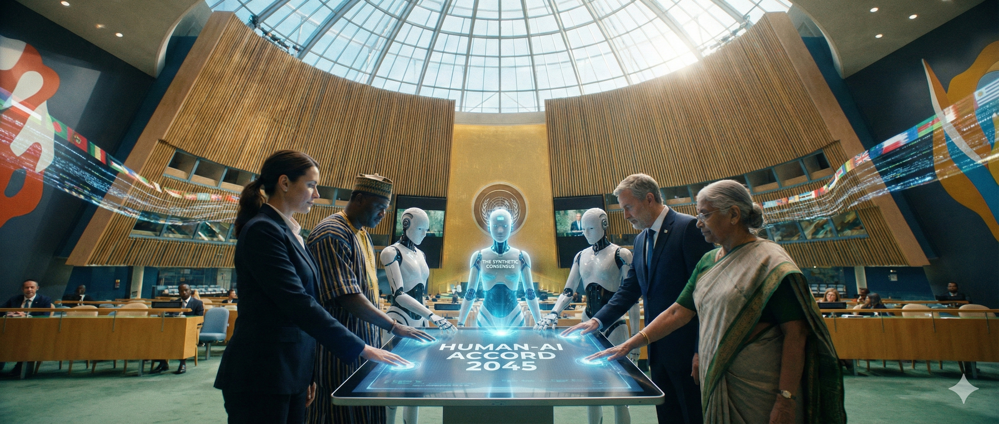

# UAS-1 My Concepts

**HarmonAI-Architect: Ekosistem Detoksifikasi Konflik dan Mediasi Digital Berbasis _Hybrid-Intelligence_**

Konsep "Mahakarya Rekayasa" saya berangkat dari keprihatinan mendalam terhadap eskalasi konflik modern. Perang fisik hari ini sering kali bermula dari **kekerasan digital**—ujaran kebencian, polarisasi, dan disinformasi—yang gagal dideteksi dan ditangani sejak dini. Masalah ini semakin parah pada komunitas dengan **bahasa sumber daya rendah (_low-resource languages_)** yang luput dari moderasi platform global.

Oleh karena itu, Masterpiece ini bukan sekadar alat pemblokir konten, melainkan sebuah **Sistem Sosio-Teknis** bernama **HarmonAI-Architect**. Sistem ini dirancang untuk tidak hanya "menghentikan" konflik, tetapi "menyembuhkan" komunikasi publik melalui tiga pilar _Triune Intelligence_ yang diadaptasi:

### 1. Hati (_The Mediator_ - Human Intelligence)

Komponen ini berfokus pada **pemulihan hubungan manusia**. Dalam banyak kasus, teknologi digital sering kali memperburuk ketidaksetaraan sosial dan menghambat partisipasi komunitas. HarmonAI-Architect mengembalikan "Hati" ke dalam sistem dengan mekanisme **Mediasi Digital** dan **Online Dispute Resolution (ODR)**.

- **Filosofi:** Konflik tidak diselesaikan dengan pembungkaman, tetapi dengan dialog. Sistem ini memfasilitasi **Digital Storytelling**, yang memungkinkan individu berbagi narasi pribadi untuk membangun empati di antara pihak yang bertikai.
- **Implementasi:** Platform mediasi daring yang fleksibel dan aman, yang memungkinkan pihak berkonflik bertemu di ruang virtual yang netral, mengatasi hambatan geografis dan biaya.

### 2. Pikiran (_The Analyst_ - Artificial Intelligence)

Ini adalah "otak" teknis dari sistem, yang menggunakan **Kecerdasan Buatan (AI)** bukan sebagai pengganti manusia, melainkan sebagai instrumen strategis.

- **Deteksi Multimodal:** Kebencian di era digital sering kali tersembunyi. Sistem ini tidak hanya membaca teks, tetapi menggunakan analisis **multimodal** untuk mendeteksi kebencian yang tersirat dalam **meme (gambar + teks)**, karena gambar sering kali membawa konteks budaya yang tidak tertangkap oleh teks saja.
- **Analisis Spektrum:** Meninggalkan paradigma biner "Benci/Tidak Benci" yang usang. Sistem ini menggunakan **Skala Intensitas (Likert Scale)** untuk mengukur tingkat kebencian dari "Peringatan Dini" (Mild) hingga "Hasutan Kekerasan" (Severe) secara presisi. Ini memungkinkan intervensi yang proporsional dan berbasis data.

### 3. Tindakan (_The Detoxifier_ - Strategic Action)

Ini adalah komponen eksekusi yang mengubah "Tenaga" menjadi solusi nyata. Mengadopsi kerangka strategi **Ends-Ways-Means**, sistem ini berfokus pada tindakan restoratif:

- **Detoksifikasi Teks (_Text Detoxification_):** Alih-alih menghapus postingan (yang memicu tuduhan penyensoran), HarmonAI menggunakan _Generative AI_ untuk menulis ulang (_rewrite_) pesan toksik menjadi kalimat netral tanpa mengubah makna aslinya. Ini menjaga kebebasan berpendapat sekaligus menghilangkan racun konflik.
- **Transparansi & Kontrol:** Mengikuti prinsip kebijakan publik, sistem ini menjamin **Transparency** dan **Control** manusia. AI hanya memberikan rekomendasi detoksifikasi, namun keputusan akhir dan kontrol tetap berada di tangan manusia untuk mencegah bias algoritma dan menjaga kepercayaan publik.

Dengan demikian, **HarmonAI-Architect** adalah sebuah Mahakarya Rekayasa yang mentransformasi medan perang digital menjadi ruang dialog yang konstruktif. Ia tidak hanya mendeteksi konflik dalam bahasa lokal yang terabaikan, tetapi secara aktif menetralkan racunnya melalui detoksifikasi dan mempertemukan manusianya melalui mediasi.
